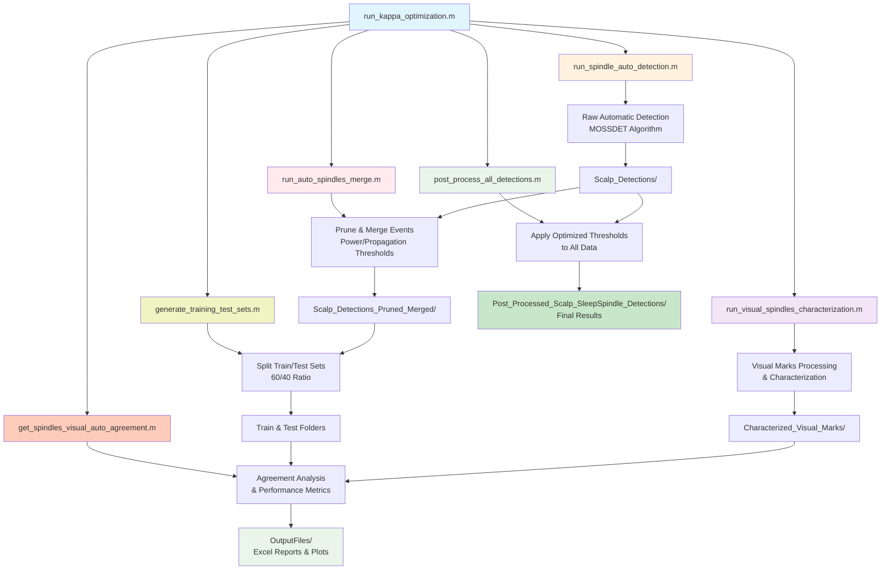

# Spindle Detector


## Table of Contents

1. [Project Overview](#project-overview)
2. [Project Structure](#project-structure)
3. [Workflow](#workflow)
   - [Individual Script Overview](#individual-script-overview)
4. [Usage](#usage)
   - [Quick Start](#quick-start)
   - [Alternative Entry Point](#alternative-entry-point)
   - [Post-Processing with Optimized Parameters](#post-processing-with-optimized-parameters)
   - [Individual Scripts](#individual-scripts)
5. [Output](#output)
6. [Age Groups Processed](#age-groups-processed)
7. [Characterization of Sleep-Spindle detector](#characterization-of-sleep-spindle-detector)
   - [Performance Results](#performance-results)
     - [Overall Performance Metrics](#overall-performance-metrics)
     - [Performance by Age Group](#performance-by-age-group)
   - [Cohen's Kappa Score Interpretation](#cohens-kappa-score-interpretation)
     - [Kappa Score Ranges and Interpretation](#kappa-score-ranges-and-interpretation)
8. [Development Environment](#development-environment)
   - [Dependencies](#dependencies)

---

## Project Overview

Local deployment of the MOSSDET.exe detector. Includes: 
1. Post-processing steps based on the spindle power and extent of channel propagation.
    - The optimized thresholds are obtained using the training set.
    - The final sleep-spindle detection performance is obtained using the test set
    - The data is partitioned using a 60/40 ratio (training/test)

2. Add further spindle features to each detection:
    - Band-passed power (uV<sup>2</sup>)
    - Peak frequency (Hz) (Frequency showing the maximum power)
    - Duration (ms)
    - Nr. channels showing the same spindle event.

3. Merge temporally coincident sleep-spindles, keep the spindle with the highest bp-power. The premise is that the spindle with the highest bp-power is the source spindle and all other temporally coincident spindles are propagations. 


## Project Structure

- `spindle-detector/` - Main project directory
    - `src/` - Main source code directory
        - `run_spindle_auto_detection.m` - Automatic spindle detection using MOSSDET
        - `run_visual_spindles_characterization.m` - Visual marks processing and characterization
        - `run_auto_spindles_merge.m` - Merge and prune automatic detections based on thresholds
        - `get_spindles_visual_auto_agreement.m` - Agreement analysis between visual and automatic detection
        - `utils/` - Utility functions (MOSSDET detection, feature extraction, event merging)
        - `montageCreation/` - EEG montage generation functions
        - `dsp/` - Digital signal processing utilities
    - `full_run_spindle_analysis.m` - Main analysis pipeline entry point
    - `run_kappa_optimization.m` - Grid search optimization for detection parameters
    - `post_process_all_detections.m` - Apply optimized thresholds to all detections without train/test splitting
    - `Scalp_Detections/` - Raw automatic detections by age group
    - `Post_Processed_Scalp_SleepSpindle_Detections/` - Final processed detections using optimized parameters
    - `Scalp_Detections_Pruned_Merged_Train/` - Training set after pruning and merging
    - `Scalp_Detections_Pruned_Merged_Test/` - Test set after pruning and merging
    - `Characterized_Visual_Marks/` - Processed visual spindle annotations by age group
    - `OutputFiles/` - Analysis results, plots, and Excel reports
    - `tests/` - Comprehensive test suite for all functionality
        - `badges/` - Automated badge update system for README
            - `update_badges.m` - Main MATLAB badge updater
            - `update_badges.bat` - Windows batch script
            - `update_badges.ps1` - PowerShell script  
            - `pre-commit-hook.sh` - Git hook for automatic updates
            - `BADGE_SYSTEM.md` - Complete documentation

## Workflow



### Individual Script Overview

1. **run_spindle_auto_detection.m**
   - Runs MOSSDET spindle detection on EEG data
   - Extracts basic spindle events and saves to `Scalp_Detections/`

2. **run_visual_spindles_characterization.m**
   - Processes visual spindle annotations
   - Adds feature characterization to visual marks
   - Outputs to `Characterized_Visual_Marks/`

3. **run_auto_spindles_merge.m**
   - Applies power and propagation thresholds to automatic detections
   - Merges overlapping events (keeps highest power spindle)
   - Outputs pruned/merged detections

4. **generate_training_test_sets.m**
   - Splits data into training (60%) and test (40%) sets
   - Creates separate folders for train/test data

5. **get_spindles_visual_auto_agreement.m**
   - Compares automatic vs visual detections
   - Calculates performance metrics (sensitivity, specificity, kappa)
   - Generates visualizations and Excel reports
   - Outputs to `OutputFiles/`

6. **post_process_all_detections.m**
   - Applies optimized thresholds (power=26.5, propagation=4) to all raw detections
   - Uses parameters obtained from `run_kappa_optimization.m`
   - Processes entire dataset without train/test splitting
   - Outputs final detections to `Post_Processed_Scalp_SleepSpindle_Detections/`

## Usage

### Quick Start
Run the complete optimization pipeline:
```matlab
run_kappa_optimization
```

This performs a grid search optimization and executes:
1. `run_spindle_auto_detection.m` - Raw automatic detection
2. `run_visual_spindles_characterization.m` - Visual marks processing  
3. `run_auto_spindles_merge.m` - Apply pruning/merging with various thresholds
4. `generate_training_test_sets.m` - Split data into train/test sets
5. `get_spindles_visual_auto_agreement.m` - Performance evaluation

### Alternative Entry Point
For a simplified analysis without optimization:
```matlab
full_run_spindle_analysis
```

### Post-Processing with Optimized Parameters
After optimization, apply the best parameters to all data:
```matlab
post_process_all_detections
```

This script uses the optimized thresholds (power=26.5, propagation=4) obtained from the grid search to process all detections and save the final results to `Post_Processed_Scalp_SleepSpindle_Detections/`.

### Individual Scripts
You can also run each script independently:

```matlab
% Setup
cfg = startup_cfg();
fieldtrip_init(cfg);

% Raw automatic detection
run_spindle_auto_detection

% Process visual annotations
run_visual_spindles_characterization  

% Apply thresholds and merge (requires parameters)
run_auto_spindles_merge(cfg, power_threshold, propagation_threshold)

% Perform agreement analysis
get_spindles_visual_auto_agreement(cfg, agreement_window_ms, dataset_name, plot_flag)
```


## Output

- **Performance metrics**: Excel files with sensitivity, specificity, and kappa scores
- **Visualizations**: Boxplots showing performance across age groups  
- **Detection files**: 
  - Raw detections in `Scalp_Detections/` (.mat files)
  - Final processed detections in `Post_Processed_Scalp_SleepSpindle_Detections/` (.mat files)
  - Training/test splits in respective folders
- **Analysis logs**: Detailed processing information

## Age Groups Processed

- HFOHealthy1monto2yrs (1 month to 2 years)
- HFOHealthy3to5yrs (3 to 5 years)  
- HFOHealthy6to10yrs (6 to 10 years)
- HFOHealthy11to13yrs (11 to 13 years)
- HFOHealthy14to17yrs (14 to 17 years)

## Characterization of Sleep-Spindle detector


### Performance Results

#### Overall Performance Metrics

| Metric | Mean ± Std. Dev. |
|--------|-------------------|
| **Sensitivity** | 0.700 ± 0.236 |
| **Specificity** | 0.919 ± 0.057 |
| **Precision** | 0.488 ± 0.223 |
| **Kappa (κ)** | **0.501 ± 0.206** |

#### Performance by Age Group

| Age Group | n | Sensitivity | Specificity | Precision | Kappa (κ) |
|-----------|---|-------------|-------------|-----------|-----------|
| **1mo-2yrs** | 4 | 0.755 ± 0.148 | 0.950 ± 0.008 | 0.744 ± 0.026 | **0.695 ± 0.083** |
| **3-5yrs** | 4 | 0.772 ± 0.177 | 0.876 ± 0.047 | 0.436 ± 0.187 | **0.486 ± 0.220** |
| **6-10yrs** | 4 | 0.787 ± 0.137 | 0.871 ± 0.074 | 0.344 ± 0.131 | **0.408 ± 0.149** |
| **11-13yrs** | 4 | 0.475 ± 0.365 | 0.972 ± 0.021 | 0.469 ± 0.324 | **0.426 ± 0.306** |
| **14-17yrs** | 4 | 0.712 ± 0.242 | 0.927 ± 0.043 | 0.446 ± 0.188 | **0.489 ± 0.169** |

*Performance metrics calculated using optimized thresholds (power=26.5, propagation=4) on test set (40% of data). Results show mean ± standard deviation across subjects within each age group.*

### Cohen's Kappa Score Interpretation
The performance results are primarily evaluated using **Cohen's kappa (κ)**, which measures inter-rater agreement and considers the entire confusion matrix.
#### Kappa Score Ranges and Interpretation
| Kappa Value | Strength of Agreement | Clinical Interpretation |
|-------------|----------------------|------------------------|
| < 0.00 | Poor | Less than chance agreement |
| 0.00 - 0.20 | Slight | Minimal agreement |
| 0.21 - 0.40 | Fair | Low agreement |
| 0.41 - 0.60 | Moderate | Acceptable agreement |
| 0.61 - 0.80 | Substantial | Good agreement |
| 0.81 - 1.00 | Almost Perfect | Excellent agreement |
*Reference: Landis, J.R. & Koch, G.G. (1977). The measurement of observer agreement for categorical data. Biometrics, 33(1), 159-174.*
*References: Cohen, J. (1960). A coefficient of agreement for nominal scales. Educational and Psychological Measurement, 20(1), 37-46.*


## Development Environment
MATLAB Version: 23.2.0.2859533 (R2023b) Update 10 <br>
Operating System: Microsoft Windows 11 Home Version 10.0 <br>
Java Version: Java 1.8.0_202-b08 with Oracle Corporation Java HotSpot(TM) 64-Bit Server VM mixed mode <br>
### Dependencies
- MATLAB                                                Version 23.2        (R2023b)
- Signal Processing Toolbox                             Version 23.2        (R2023b)
- Wavelet Toolbox                                       Version 23.2        (R2023b)

